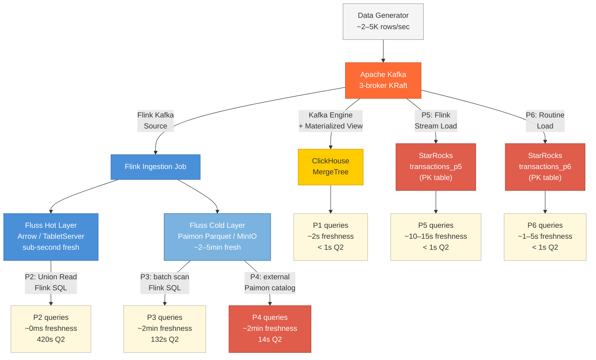

# Streaming Analytics Benchmark

End-to-end benchmark comparing six ingestion and query patterns across ClickHouse, Apache Fluss, Apache Flink, and StarRocks — all fed from a common Kafka backbone.

Full architectural decisions and pattern analysis: [PATTERNS.md](./PATTERNS.md).
Final benchmark results and comparison: [BENCHMARK.md](./BENCHMARK.md).

---

## Architecture



---

## What This Benchmarks

| Pattern | Stack | Freshness | Query model |
|---|---|---|---|
| P1 | ClickHouse ← Kafka Engine | 1–10s | Batch (re-run) |
| P2 | Flink SQL on Fluss (Union Read: hot + cold) | ~500ms–3s | Batch (re-run on live table) |
| P3 | Flink SQL on Fluss cold lake only (`$lake`) | ~2min | Batch (Parquet columnar scan) |
| P4 | StarRocks ← Fluss Paimon catalog | ~2min | Batch (re-run) |
| P5 | StarRocks ← Flink streaming write | 2–10s | Batch (re-run, live data) |
| P6 | StarRocks ← Kafka Routine Load | ~50s (Docker); 1–5s (prod) | Batch (re-run) |

Three metrics captured per pattern per query:

| Metric | Formula | What it measures |
|---|---|---|
| `freshness_lag_ms` | `NOW() - MAX(event_time)` | How stale is the newest data the query can see? |
| `query_latency_ms` | Wall time: submit → last row | How long did the engine take to answer? |
| `pipeline_lag_ms` | `MAX(ingest_time) - MAX(event_time)` | How long did the ingestion path itself take? |

---

## Prerequisites

- **Docker Desktop ≥ 4.x** — allocate at least **12 GB RAM** (Flink + Fluss + ClickHouse together need ~8–10 GB)
- **`docker compose` v2** — bundled with Docker Desktop
- **`make`**
- **`curl`** and **`python3`** — for smoke tests and Flink REST API queries
- Free ports on host: `9092`, `8081`, `8082`, `8090`, `9090`, `9308`, `3000`, `8123`, `9000`, `9001`, `9123`

Check Docker memory:
```bash
docker system info | grep -i memory
```

---

## Repository Layout

```
Analytics/
├── README.md                    ← you are here
├── PATTERNS.md                  ← full architectural documentation for all 6 patterns
├── Makefile                     ← all operational commands
├── docker-compose.yml           ← all services (grows per phase)
├── docs/
│   └── flink-fluss-lakehouse.md ← deep dive: Flink+Fluss+Paimon setup, config, failures
└── docker/
    ├── generator/
    │   ├── Dockerfile
    │   ├── producer.py          ← multi-threaded confluent-kafka producer
    │   └── requirements.txt
    ├── clickhouse/
    │   ├── config/
    │   │   └── timezone.xml     ← forces server timezone to UTC
    │   ├── init/
    │   │   ├── 01_schema.sql    ← MergeTree target table (event_time + ingest_time)
    │   │   └── 02_kafka.sql     ← Kafka Engine table + Materialized View
    │   └── queries/
    │       └── benchmark.sql    ← Q1 / Q2 / Q3 in ClickHouse dialect
    ├── flink/
    │   ├── Dockerfile           ← fluss-quickstart-flink:1.20 + Paimon JARs + S3 plugin
    │   ├── conf/
    │   │   └── core-site.xml    ← Hadoop S3A config (required for P2 Union Read)
    │   └── sql/
    │       ├── 01_kafka_to_fluss.sql  ← streaming ingestion job (Kafka → Fluss)
    │       ├── benchmark_p2.sql       ← Q1/Q2/Q3 via Union Read (hot + cold)
    │       └── benchmark_p3.sql       ← Q1/Q2/Q3 via cold lake only ($lake suffix)
    ├── starrocks/
    │   ├── init/
    │   │   ├── 01_catalog.sql    ← CREATE EXTERNAL CATALOG paimon_catalog (run once via sr-init)
    │   │   └── 02_p6_setup.sql   ← CREATE TABLE transactions_p6 + Routine Load job (sr-p6-init)
    │   └── queries/
    │       ├── benchmark_p4.sql  ← Q1/Q2/Q3 against paimon_catalog (StarRocks dialect)
    │       └── benchmark_p6.sql  ← Q1/Q2/Q3 against analytics.transactions_p6
    ├── prometheus/
    │   └── prometheus.yml
    └── grafana/
        └── provisioning/
            ├── datasources/prometheus.yml
            └── dashboards/
                ├── provider.yml
                └── kafka-overview.json
```

---

## Service Endpoints

| Service | URL / Address | Credentials | Phase |
|---|---|---|---|
| Kafka UI | http://localhost:8090 | — | 1 |
| Grafana | http://localhost:3000 | admin / admin | 1 |
| Prometheus | http://localhost:9090 | — | 1 |
| Schema Registry | http://localhost:8081 | — | 1 |
| ClickHouse HTTP | http://localhost:8123 | — (no auth) | 2 |
| ClickHouse Native | `localhost:9000` | — (no auth) | 2 |
| Flink UI | http://localhost:8082 | — | 3 |
| MinIO console | http://localhost:9001 | minioadmin / minioadmin | 3 |
| Fluss Coordinator | `localhost:9123` | — (internal) | 3 |
| Kafka (host tools) | `localhost:9092` | — | 1 |
| Kafka (Docker-internal) | `broker:29092` | — | 1 |
| StarRocks MySQL | `localhost:9030` | root / (no password) | 4 |
| StarRocks FE HTTP | http://localhost:8030 | — | 4 |
| StarRocks BE HTTP | http://localhost:8040 | — | 4 |

---

## Phase 1 — Kafka + Data Generator

### Containers

| Container | Image | Purpose |
|---|---|---|
| `broker` | `confluentinc/cp-kafka:7.9.0` | Single-node Kafka KRaft (no Zookeeper) |
| `schema-registry` | `confluentinc/cp-schema-registry:7.9.0` | Avro schema registry (used from P6) |
| `kafka-init` | `confluentinc/cp-kafka:7.9.0` | One-shot: creates `transactions` topic, exits 0 |
| `kafka-ui` | `ghcr.io/kafbat/kafka-ui:latest` | Topic inspection + consumer group UI |
| `kafka-exporter` | `danielqsj/kafka-exporter:latest` | Consumer lag + offset metrics → Prometheus |
| `prometheus` | `prom/prometheus:latest` | Metrics storage |
| `grafana` | `grafana/grafana:latest` | Dashboards (Kafka overview pre-provisioned) |
| `generator` | (built locally) | High-volume Python producer (`confluent-kafka`) |

### Startup order

```
broker  ──(healthy)──►  schema-registry
                         kafka-ui
                         kafka-exporter
                         prometheus ──► grafana
                         kafka-init ──(exit 0)──► generator
                                                   clickhouse  (Phase 2)
```

All ordering is enforced automatically via `depends_on` + healthchecks. No manual sequencing needed.

### Start everything

```bash
make up
```

First run pulls all images (~3–4 GB total) and builds the generator image. Takes 3–5 minutes. Subsequent runs start in seconds.

### Verify Phase 1

```bash
make status
```

Expected — all `Up`, `kafka-init` shows `Exited (0)`:

```
NAME              STATUS
broker            Up X minutes (healthy)
clickhouse        Up X minutes (healthy)
generator         Up X minutes
grafana           Up X minutes
kafka-exporter    Up X minutes
kafka-init        Exited (0)
kafka-ui          Up X minutes
prometheus        Up X minutes
schema-registry   Up X minutes
```

**Check generator throughput:**
```bash
make gen-logs
```

Expected (updates every second):
```
brokers     : broker:29092
topic       : transactions
threads     : 4
target rps  : 10,000  (2,500 / thread)
------------------------------------------------------------
[10:15:01]  rps:     9,847  errors/s:   0  total:       128,421
[10:15:02]  rps:    10,203  errors/s:   0  total:       138,624
```

**Inspect a sample message:**
```bash
docker compose exec broker kafka-console-consumer \
  --bootstrap-server broker:29092 \
  --topic transactions \
  --max-messages 1 \
  --timeout-ms 5000
```

Expected shape:
```json
{
  "event_id":   "3c7d1004-4dce-48d2-9e13-8f3288aac743",
  "user_id":    9329005,
  "amount":     5299.10,
  "region":     "ap-northeast-1",
  "event_type": "refund",
  "event_time": "2026-05-25T15:35:55.092Z"
}
```

> `event_time` is millisecond-precision UTC embedded at produce time. It is the anchor field for `freshness_lag_ms` across all 6 patterns.

---

## Generator Configuration

Controlled via environment variables in `docker-compose.yml` under the `generator` service:

| Variable | Default | Description |
|---|---|---|
| `TARGET_RPS` | `10000` | Target messages/sec. `0` = unlimited. |
| `NUM_THREADS` | `4` | Parallel producer threads. |
| `ACKS` | `1` | `1` = leader ack only (max throughput). `all` = full ISR durability. |
| `COMPRESSION` | `lz4` | `lz4` \| `snappy` \| `gzip` \| `none` |
| `LINGER_MS` | `5` | Max ms to accumulate a batch before flushing. |
| `BATCH_SIZE` | `131072` | Max batch size in bytes (128 KB). |

> **Observed throughput:** The single-broker Docker setup on macOS naturally caps at ~3–5K msgs/sec despite a 10K target. This is Docker networking overhead, not a producer limitation. Actual throughput is sufficient for all benchmark patterns.

To change the rate:
```bash
# Edit docker-compose.yml TARGET_RPS, then:
docker compose up -d generator
```

### Pause / resume

```bash
make gen-pause    # docker stop (container preserved, no state lost)
make gen-resume   # docker start
```

---

## Event Schema

All patterns consume from the `transactions` Kafka topic. Plain JSON, no Schema Registry required.

| Field | Type | Description |
|---|---|---|
| `event_id` | string | UUID v4, unique per event |
| `user_id` | integer | 1–10,000,000, uniform random |
| `amount` | decimal | 0.01–9999.99, uniform random |
| `region` | string | One of 7 regions: `us-east-1`, `us-west-2`, `eu-west-1`, `eu-central-1`, `ap-southeast-1`, `ap-northeast-1`, `sa-east-1` |
| `event_type` | string | `purchase` \| `refund` \| `view` \| `add_to_cart` \| `checkout` \| `login` |
| `event_time` | string | ISO-8601, millisecond precision, UTC |

**Partition key:** `user_id` — events from the same user always land on the same partition, preserving per-user ordering for stateful Flink jobs.

---

## Benchmark Queries

The same logical queries run against all six patterns. Each engine has its own dialect file under `docker/<engine>/queries/benchmark.sql`.

### Q1 — Regional aggregate (last hour)
```sql
-- Standard SQL (reference)
SELECT   region, COUNT(*) AS cnt, SUM(amount) AS total, AVG(amount) AS avg_amount
FROM     transactions
WHERE    event_time >= NOW() - INTERVAL '1' HOUR
GROUP BY region
ORDER BY total DESC;
```

### Q2 — 1-minute tumbling windows
```sql
-- Standard SQL (reference)
SELECT
  TUMBLE_START(event_time, INTERVAL '1' MINUTE) AS window_start,
  region,
  COUNT(*)    AS event_count,
  SUM(amount) AS total_amount
FROM     transactions
GROUP BY TUMBLE(event_time, INTERVAL '1' MINUTE), region;
```

### Q3 — Freshness probe (run every 5 seconds)
```sql
-- Standard SQL (reference)
SELECT
  MAX(event_time)                            AS newest_event_time,
  NOW()                                      AS query_time,
  DATEDIFF('millisecond', MAX(event_time), NOW()) AS freshness_lag_ms,
  COUNT(*)                                   AS total_rows
FROM transactions;
```

> Run Q3 on a 5-second loop across all patterns simultaneously to build a freshness time series for side-by-side comparison.

---

## Phase 2 — ClickHouse (Pattern 1)

### Containers

| Container | Image | Purpose |
|---|---|---|
| `clickhouse` | `clickhouse/clickhouse-server:24.3` | OLAP engine + Kafka Engine consumer |

### How it works

```
Kafka topic: transactions
      │
      │  Kafka Engine — 4 consumer threads polling continuously
      ▼
analytics.kafka_transactions     ← stateless; no data stored here
      │
      │  Materialized View — fires on every polled batch
      ▼
analytics.transactions           ← MergeTree, partitioned by day
      │                            ORDER BY (region, event_time, event_id)
      ▼
SELECT queries
```

**Two timestamp columns per row:**

| Column | Set by | Meaning |
|---|---|---|
| `event_time` | Producer (in JSON payload) | When the event happened / was sent to Kafka |
| `ingest_time` | ClickHouse `DEFAULT now64(3)` | When ClickHouse committed it to MergeTree |

This enables two independent measurements:
```sql
freshness_lag_ms = dateDiff('millisecond', max(event_time), now64(3))
                 -- staleness from a query perspective

pipeline_lag_ms  = dateDiff('millisecond', max(event_time), max(ingest_time))
                 -- cost of the Kafka → MergeTree path itself
```

### Init files

| File | Runs | Contents |
|---|---|---|
| `docker/clickhouse/init/01_schema.sql` | First container start | Creates `analytics` DB + `transactions` MergeTree table |
| `docker/clickhouse/init/02_kafka.sql` | First container start | Creates `kafka_transactions` (Kafka Engine) + `kafka_transactions_mv` (Materialized View) |

> **Important:** ClickHouse only runs `/docker-entrypoint-initdb.d/` scripts **once**, on first start when the data directory is empty. If you need to re-run them (e.g. after fixing a schema), recreate the container: `docker compose rm -sf clickhouse && docker compose up -d clickhouse`.

### Start Phase 2

ClickHouse starts automatically with `make up`. To add it to an already-running stack:
```bash
docker compose up -d clickhouse
```

### Verify

```bash
curl http://localhost:8123/ping
# Expected: Ok.
```

```bash
make ch-ingestion
# Expected: shows row count + compressed size for transactions table
```

```bash
make ch-freshness
# Expected after backlog clears (~60s on first start):
# newest: 2026-05-25 15:35:55   freshness_lag_ms: 2124   total_rows: 2455444
```

**Open interactive client:**
```bash
make ch
# Opens clickhouse-client connected to analytics database
```

**Verify all three tables exist:**
```sql
SHOW TABLES IN analytics;
-- kafka_transactions
-- kafka_transactions_mv
-- transactions
```

### Verified results

Measured on a MacBook Pro (Apple M-series, 16 GB RAM, Docker Desktop 8 GB allocation):

| Metric | Observed |
|---|---|
| Steady-state `freshness_lag_ms` | **~2,100ms** |
| `pipeline_lag_ms` | ~0ms (slight clock skew between containers causes ±8s noise — cosmetic) |
| Ingestion throughput | ~12,000 rows/sec |
| Startup backlog drain | ~60–90 seconds |

### Benchmark queries (ClickHouse dialect)

Full file: `docker/clickhouse/queries/benchmark.sql`

Key dialect differences from standard SQL:

| Concept | Standard SQL | ClickHouse |
|---|---|---|
| Current timestamp | `NOW()` | `now64(3)` |
| Date diff in ms | `DATEDIFF('millisecond', a, b)` | `dateDiff('millisecond', a, b)` |
| Tumbling window | `TUMBLE(ts, INTERVAL '1' MINUTE)` | `toStartOfMinute(ts)` |
| Row count | `COUNT(*)` | `count()` |

**Q1:**
```sql
SELECT region, count() AS cnt, sum(amount) AS total, avg(amount) AS avg_amount
FROM analytics.transactions
WHERE event_time >= now64(3) - INTERVAL 1 HOUR
GROUP BY region
ORDER BY total DESC;
```

**Q2:**
```sql
SELECT toStartOfMinute(event_time) AS window_start, region,
       count() AS event_count, sum(amount) AS total_amount
FROM analytics.transactions
GROUP BY window_start, region
ORDER BY window_start DESC, total_amount DESC
LIMIT 120;
```

**Q3:**
```sql
SELECT
    max(event_time)                                             AS newest_event_time,
    now64(3)                                                    AS query_time,
    dateDiff('millisecond', max(event_time), now64(3))         AS freshness_lag_ms,
    dateDiff('millisecond', max(event_time), max(ingest_time)) AS pipeline_lag_ms,
    count()                                                     AS total_rows
FROM analytics.transactions;
```

### Tuning freshness

The main lever is `kafka_max_block_size` in `docker/clickhouse/init/02_kafka.sql` — it controls how many rows trigger a flush from the Kafka Engine to the Materialized View:

| `kafka_max_block_size` | Effect |
|---|---|
| 65536 (default) | Flushes when 64K rows buffered — ~2s freshness at 10K msg/s |
| 8192 | Flushes more frequently — ~500ms freshness, more write I/O |
| 262144 | Larger batches — ~8s freshness, fewer writes, better compression |

To apply a change: update `02_kafka.sql`, then:
```bash
docker compose rm -sf clickhouse
docker compose up -d clickhouse
```

### ClickHouse commands

```bash
make ch                                    # interactive clickhouse-client
make ch-query Q="SELECT count() FROM transactions"  # run any query inline
make ch-ingestion                          # row count + compression ratio
make ch-freshness                          # Q3 freshness probe
make ch-lag                                # Kafka consumer status per thread
```

### Troubleshooting

**`kafka_transactions` or `kafka_transactions_mv` missing after container start:**

The init scripts failed silently (check `docker compose logs clickhouse | grep -i error`). Most common cause in ClickHouse 24.x: using a removed setting. Run the fixed SQL manually:
```bash
docker compose exec clickhouse clickhouse-client --multiquery < docker/clickhouse/init/02_kafka.sql
```

**No rows after 30 seconds (`make ch-freshness` returns epoch time):**
```bash
make ch-lag          # check exceptions.text column for connection errors
docker compose logs clickhouse | tail -30
```
Fix: restart ClickHouse so it reconnects to Kafka:
```bash
docker compose restart clickhouse
```

**`freshness_lag_ms` stays very high (>60s):**
ClickHouse is draining a Kafka backlog from before it started. Wait ~60–90s for it to catch up to the live stream. Monitor with:
```bash
watch -n2 "make ch-freshness"
```

**`pipeline_lag_ms` is negative:**
Expected — minor clock skew between Docker containers (generator clock slightly ahead of ClickHouse clock). The magnitude (~8s) is cosmetic and does not affect `freshness_lag_ms` accuracy.

---

## Phase 3 — Flink + Fluss (Patterns 2 & 3)

> **Full setup details, failure modes, and configuration reference:** [docs/flink-fluss-lakehouse.md](./docs/flink-fluss-lakehouse.md)

### Containers

| Container | Image | Purpose |
|---|---|---|
| `zookeeper` | `zookeeper:3.9.2` | Fluss cluster coordination (metadata + leader election) |
| `minio` | `minio/minio:latest` | S3-compatible object store — cold layer (Parquet files) |
| `minio-init` | `minio/mc:latest` | One-shot: creates `fluss` bucket, exits 0 |
| `coordinator-server` | `apache/fluss:0.9.1-incubating` | Fluss CoordinatorServer — metadata, tablet assignment |
| `tablet-server` | `apache/fluss:0.9.1-incubating` | Fluss TabletServer — hot data (Arrow/RAM) + cold flush |
| `flink-jobmanager` | (built locally) | Flink JobManager — UI at `:8082`, REST API at `:8082` |
| `flink-taskmanager` | (built locally) | Flink TaskManager — 4 slots, executes both ingestion and tiering jobs |

The Flink image is built from `apache/fluss-quickstart-flink:1.20-0.9.1-incubating` (Fluss connector pre-bundled) plus Paimon JARs and the Flink S3 Hadoop plugin. See `docker/flink/Dockerfile` and `docs/flink-fluss-lakehouse.md` for the full JAR inventory.

### How it works

```
Kafka topic: transactions
      │
      │  Flink streaming job (parallelism 1, consumer group: flink-fluss-consumer)
      │  01_kafka_to_fluss.sql — submitted manually via `make flink-submit`
      ▼
 tablet-server  ←───────── coordinator-server ←── zookeeper
 (Arrow / RAM)                (metadata)           (coordination)
      │
      │  Lakehouse Tiering Service (separate Flink job — fluss-flink-tiering JAR)
      │  Tiering epoch: every ~2min  (table.datalake.freshness = 2m)
      ▼
   MinIO: s3://fluss/paimon-warehouse/
   (Parquet files — columnar, Paimon format)
      │
      ├──────────────────────────────┐
      ▼                              ▼
 P2: Union Read                  P3: Cold lake only
 (hot + cold, transparent)       ($lake suffix)
 freshness: ~500ms–3s            freshness: ~2min (one tiering epoch)
```

**Union Read** is transparent — querying `analytics.transactions` in the Fluss catalog automatically merges the hot Arrow layer and the cold Parquet layer. No special SQL syntax needed. Implemented in Flink via `FlinkSourceEnumerator` + `LakeSplitGenerator`.

**Cold-only read** uses the `$lake` table suffix (`transactions$lake`) to bypass the hot layer entirely, scanning only compacted Parquet files in MinIO.

**Two timestamp columns** (same design as ClickHouse):

| Column | Set by | Meaning |
|---|---|---|
| `event_time` | Producer (in JSON payload) | When the event happened |
| `ingest_time` | `CURRENT_TIMESTAMP` in Flink SQL | When Flink wrote it to Fluss |

### Startup order

```
zookeeper ──(healthy)──► minio ──(healthy)──► minio-init ──(exit 0)──► coordinator-server
                                                                               │
                                                                         tablet-server
                                                                               │
                kafka-init ──(exit 0)──► flink-jobmanager ──(healthy)──► flink-taskmanager
```

After all containers are up and healthy, submit the two Flink jobs manually:

```bash
make flink-submit
```

This submits: (1) the tiering job (`fluss-flink-tiering-0.9.1-incubating.jar`) with checkpointing enabled, and (2) the Kafka→Fluss streaming ingestion job via SQL client.

### Start Phase 3

```bash
make up             # start all services (Phase 1–3)
make flink-submit   # submit both Flink jobs (tiering + ingestion)
```

If Phase 1 & 2 are already running, start only Phase 3 services:
```bash
docker compose up -d zookeeper minio minio-init
docker compose up -d coordinator-server tablet-server
docker compose up -d flink-jobmanager flink-taskmanager
make flink-submit
```

> **First build:** The Flink image builds locally from `docker/flink/Dockerfile`. First `make up` takes 3–5 extra minutes. Subsequent runs use the Docker build cache.

### Verify

**All containers healthy:**
```bash
make status
```

Expected Phase 3 additions:
```
NAME                  STATUS
coordinator-server    Up X minutes (healthy)
flink-jobmanager      Up X minutes (healthy)
flink-taskmanager     Up X minutes
minio                 Up X minutes (healthy)
minio-init            Exited (0)
tablet-server         Up X minutes
zookeeper             Up X minutes (healthy)
```

**Both Flink jobs are RUNNING (after `make flink-submit`):**
```bash
make flink-jobs
```

Expected — two jobs in `RUNNING` state (tiering job + ingestion job):
```json
{
    "jobs": [
        {"id": "abc123...", "status": "RUNNING"},
        {"id": "def456...", "status": "RUNNING"}
    ]
}
```

Or open the Flink UI:
```bash
make flink     # → http://localhost:8082
```

**Verify cold layer has data (allow ~2min for first tiering epoch):**
```bash
make minio     # → http://localhost:9001  (minioadmin / minioadmin)
# Navigate to: fluss/paimon-warehouse/analytics.db/transactions/snapshot/
# Should show LATEST + snapshot-1 once the first epoch commits
```

### Benchmark queries (Flink SQL dialect)

Full files: `docker/flink/sql/benchmark_p2.sql` and `benchmark_p3.sql`

Key dialect differences from standard SQL:

| Concept | Standard SQL | Flink SQL |
|---|---|---|
| Current timestamp | `NOW()` | `CURRENT_TIMESTAMP` or `NOW()` |
| Date diff in ms | `DATEDIFF('ms', a, b)` | `TIMESTAMPDIFF(SECOND, a, b) * 1000` — `MILLISECOND` is not a valid unit |
| Tumbling window | `TUMBLE(ts, INTERVAL '1' MINUTE)` | `FLOOR(ts TO MINUTE)` (batch mode) |
| Cold layer only | N/A | `\`table$lake\`` suffix |

**Run P2 benchmark (Union Read — hot + cold):**
```bash
make flink-p2
```

This runs all three queries (Q1/Q2/Q3) against `analytics.transactions` in the Fluss catalog — automatically combining the Arrow hot layer and Parquet cold layer.

**Run P3 benchmark (cold lake only — Parquet scan):**
```bash
make flink-p3
```

This runs all three queries against `` `analytics.transactions$lake` `` — bypassing the hot layer, scanning only compacted Parquet in MinIO.

**Q3 for P2 (Union Read):**
```sql
CREATE CATALOG IF NOT EXISTS fluss_catalog WITH (
    'type' = 'fluss', 'bootstrap.servers' = 'coordinator-server:9123'
);
USE CATALOG fluss_catalog; USE analytics;
SET 'execution.runtime-mode' = 'BATCH';

SELECT
    MAX(event_time)                                                                    AS newest_event_time,
    CAST(CURRENT_TIMESTAMP AS TIMESTAMP(3))                                            AS query_time,
    TIMESTAMPDIFF(SECOND, MAX(event_time), CAST(CURRENT_TIMESTAMP AS TIMESTAMP(3))) * 1000
                                                                                       AS freshness_lag_ms,
    TIMESTAMPDIFF(SECOND, MAX(event_time), MAX(ingest_time)) * 1000                   AS pipeline_lag_ms,
    COUNT(*)                                                                           AS total_rows
FROM transactions;
```

> **Note:** `CURRENT_TIMESTAMP` returns `TIMESTAMP_LTZ` in Flink SQL, not `TIMESTAMP(3)`. Using it directly in `TIMESTAMPDIFF` with a `TIMESTAMP(3)` column throws `CodeGenException: TIMESTAMP_LTZ only supports diff between the same type`. The explicit `CAST` is required.

**Q3 for P3 (cold lake only):**
```sql
-- same catalog setup as above, then:
SELECT ... FROM `transactions$lake`;
```

**Interactive SQL client:**
```bash
make flink-sql
# Opens a Flink SQL client session connected to the running JobManager.
# Paste statements from benchmark_p2.sql or benchmark_p3.sql.
```

### Flink + Fluss commands

```bash
make flink              # open Flink UI (http://localhost:8082)
make flink-jobs         # list jobs and status via REST API
make flink-logs         # follow jobmanager + taskmanager logs
make flink-sql          # interactive Flink SQL client
make flink-p2           # run P2 benchmark queries (Union Read)
make flink-p3           # run P3 benchmark queries (cold lake)
make flink-cancel       # cancel all RUNNING jobs
make flink-submit       # re-submit tiering + ingestion jobs (cancel first)
make minio              # open MinIO console (http://localhost:9001)
```

### Troubleshooting

**Jobs not appearing after `make flink-submit`:**

The job may be in INITIALIZING state. Wait 10–15s then check `make flink-jobs`. If still empty, verify the JobManager is healthy:
```bash
make status
make flink-jobs
```

**`make flink-p2` fails with `UnsupportedSchemeException: Could not find a file io implementation for scheme 's3'`:**

The Flink containers are missing `HADOOP_CONF_DIR` or `core-site.xml`. P2 Union Read uses a different S3 code path than P3 — it goes through Paimon's `HadoopFileIO` fallback, which reads from `core-site.xml`. See `docs/flink-fluss-lakehouse.md` → "The Two S3 Code Paths" for the full explanation.

Fix: ensure both `flink-jobmanager` and `flink-taskmanager` have `HADOOP_CONF_DIR=/opt/flink/conf` and the bind mount `./docker/flink/conf/core-site.xml:/opt/flink/conf/core-site.xml:ro`, then:
```bash
docker compose up -d --force-recreate flink-jobmanager flink-taskmanager
make flink-submit
```

**`make flink-p2` or `make flink-p3` returns empty results:**

Cold layer (P3): allow ~2min after the tiering job starts for the first tiering epoch to complete and commit a Paimon snapshot. Check:
```bash
docker compose exec minio mc ls local/fluss/paimon-warehouse/analytics.db/transactions/snapshot/ 2>/dev/null
```

Hot layer (P2 Union Read): should have data within seconds of ingestion starting. If empty, confirm both jobs are RUNNING (`make flink-jobs`) and the generator is producing (`make gen-logs`).

**Ingestion job FAILED after running briefly:**

```bash
docker compose logs flink-taskmanager | grep -i exception
```

Restart Fluss and resubmit:
```bash
docker compose restart coordinator-server tablet-server
make flink-cancel
make flink-submit
```

**Full Phase 3 reset (wipes Fluss data and MinIO cold files):**
```bash
make clean   # removes all volumes including fluss-data and minio-data
make up      # rebuilds and restarts everything
make flink-submit
```

---

## Phase 4 — StarRocks (Pattern 4)

### Containers

| Container | Image | Purpose |
|---|---|---|
| `starrocks` | `starrocks/allin1-ubi:latest` | StarRocks all-in-one (FE + BE) — OLAP query engine + Paimon catalog |

StarRocks reads the same cold-layer Parquet files that Flink P3 reads (in MinIO at `s3://fluss/paimon-warehouse`), via an external Paimon catalog. No Flink cluster is needed for queries — StarRocks handles everything once the catalog is configured.

### How it works

```
MinIO: s3://fluss/paimon-warehouse/   ← Parquet files, written by Flink tiering job
      │
      │  External Catalog (CREATE EXTERNAL CATALOG paimon_catalog)
      ▼
┌─────────────────────────────────────────────────────────────┐
│  StarRocks 3.3                                              │
│  FE — query planning, catalog metadata (reads Paimon manifests from MinIO)  │
│  BE — vectorized MPP scan of Parquet files in MinIO         │
│                                                             │
│  SELECT * FROM paimon_catalog.analytics.transactions        │
└─────────────────────────────────────────────────────────────┘
```

### Start Phase 4

StarRocks starts automatically with `make up` (depends on `minio-init`). To add it to an already-running stack:
```bash
docker compose up -d starrocks
```

Wait ~90s for FE + BE to fully initialize (image is ~1.5 GB, first start is slow).

### Init the Paimon catalog (run once)

```bash
make sr-init
# Creates paimon_catalog in StarRocks pointing at s3://fluss/paimon-warehouse
```

This runs `docker/starrocks/init/01_catalog.sql`:

```sql
CREATE EXTERNAL CATALOG IF NOT EXISTS paimon_catalog
COMMENT "Fluss cold lake — Paimon Parquet on MinIO"
PROPERTIES (
  "type"                              = "paimon",
  "paimon.catalog.type"               = "filesystem",
  "paimon.catalog.warehouse"          = "s3://fluss/paimon-warehouse",
  "aws.s3.use_aws_sdk_default_behavior" = "false",
  "aws.s3.enable_path_style_access"   = "true",
  "aws.s3.access_key"                 = "minioadmin",
  "aws.s3.secret_key"                 = "minioadmin",
  "aws.s3.endpoint"                   = "http://minio:9000",
  "aws.s3.region"                     = "us-east-1"
);
```

> **Note:** StarRocks uses the `aws.s3.*` namespace (not `s3.*`). The `enable_path_style_access = true` property is required for MinIO (path-style S3 URLs).

### Verify

```bash
make sr-query Q="SHOW CATALOGS"
# paimon_catalog should appear (type: Paimon)

make sr-query Q="SHOW TABLES FROM paimon_catalog.analytics"
# transactions

make sr-query Q="SELECT COUNT(*) FROM paimon_catalog.analytics.transactions"
# Should return ~2M+ rows (grows with each tiering epoch)
```

> **First query cold start:** The FE JVM warms up on the first query and fetches Paimon metadata from MinIO for the first time. This can trigger `ERROR 1064: StarRocks planner use long time 3000 ms`. Fix: run `SET new_planner_optimize_timeout=30000;` in the same session, or just retry — subsequent queries are fast once the JVM is warm.

### Benchmark queries (StarRocks dialect)

Full file: `docker/starrocks/queries/benchmark_p4.sql`

Key dialect differences from standard SQL:

| Concept | Standard SQL | StarRocks |
|---|---|---|
| Current timestamp | `NOW()` | `NOW()` |
| Date diff in ms | `DATEDIFF('millisecond', a, b)` | `TIMESTAMPDIFF(SECOND, a, b) * 1000` |
| Tumbling window | `TUMBLE(ts, INTERVAL '1' MINUTE)` | `DATE_TRUNC('MINUTE', ts)` |
| Row count | `COUNT(*)` | `COUNT(*)` |

**Run P4 benchmark:**
```bash
make sr-p4
```

**Q3 freshness probe:**
```bash
make sr-freshness
```

**Q3 SQL (StarRocks dialect):**
```sql
SELECT MAX(event_time)                                           AS newest_event_time,
       NOW()                                                     AS query_time,
       TIMESTAMPDIFF(SECOND, MAX(event_time), NOW()) * 1000     AS freshness_lag_ms,
       TIMESTAMPDIFF(SECOND, MAX(event_time), MAX(ingest_time)) * 1000 AS pipeline_lag_ms,
       COUNT(*)                                                  AS total_rows
FROM paimon_catalog.analytics.transactions;
```

### Verified results

Measured on MacBook Pro (Apple M-series, 16 GB RAM, Docker Desktop 8 GB). ~2.1M rows in cold lake, generator paused before queries, StarRocks 3.3.0:

| Metric | Observed |
|---|---|
| Q1 — regional aggregate (last 1h) | 0 rows, ~17.5s (data > 1h old — expected) |
| Q2 — tumbling windows | 70 rows (10 min × 7 regions), **~14s** |
| Q3 — `freshness_lag_ms` | ~10,844,000ms (3h — generator stopped) |
| Q3 — `pipeline_lag_ms` | ~3,817,000ms (backfill artifact; ~0ms steady-state) |
| Q3 — `total_rows` | 2,145,583 |
| **vs Flink P3 Q2** | **~10× faster** (StarRocks 14s vs Flink 132s, similar row count) |

### StarRocks commands (P4)

```bash
make sr                                    # interactive MySQL client
make sr-query Q="SELECT ..."               # run any query inline
make sr-init                               # create Paimon external catalog (run once)
make sr-p4                                 # run full P4 benchmark (Q1/Q2/Q3)
make sr-freshness                          # Q3 freshness probe only
```

### Troubleshooting

**`make sr-init` fails with `Can't connect to MySQL server`:**

StarRocks is still starting. The BE takes ~90s to register with the FE after container start. Check:
```bash
docker compose logs starrocks | tail -20
make sr-query Q="SHOW BACKENDS\G"
# Alive: true means BE is registered and ready
```

**First query times out with `planner use long time 3000 ms`:**

JVM cold start + first Paimon metadata fetch from MinIO. Retry or run:
```bash
make sr-query Q="SET new_planner_optimize_timeout=30000; SELECT COUNT(*) FROM paimon_catalog.analytics.transactions"
```

**`paimon_catalog` returns no tables:**

The Flink tiering job must have completed at least one epoch before Paimon snapshot metadata is available in MinIO. Wait ~2min after `make flink-submit` and check:
```bash
docker compose exec minio mc ls local/fluss/paimon-warehouse/analytics.db/transactions/snapshot/ 2>/dev/null
```

---

## Phase 4 — StarRocks Pattern 5 (Flink Stream Write)

### What it is

A Flink streaming job reads from Kafka and writes to a native StarRocks Primary Key table via Stream Load. Unlike P4 (which reads a cold snapshot) this path is continuously flowing — every event is visible in StarRocks within seconds of landing in Kafka.

### How it works

```
Kafka topic: transactions
        │
        ▼
┌─────────────────────────────────────────────────────────────┐
│  Flink 1.20                                                 │
│                                                             │
│  kafka_transactions_p5  ──→  INSERT INTO  ──→  starrocks_p5_sink  │
│  (Kafka connector)              (SELECT/cast)    (StarRocks V1)    │
└─────────────────────────────────────────────────────────────┘
        │
        ▼  HTTP Stream Load (port 8040, V1 direct-BE)
┌─────────────────────────────────────────────────────────────┐
│  StarRocks 3.3                                              │
│  analytics.transactions_p5  (Primary Key table)             │
│  — queryable immediately after each micro-batch flush       │
└─────────────────────────────────────────────────────────────┘
```

### Start P5

```bash
# 1. Create the StarRocks target table (run once)
make sr-p5-init

# 2. Submit the Flink streaming job (Kafka → StarRocks)
make flink-submit-p5

# 3. Run Q1/Q2/Q3 benchmark
make sr-p5

# 4. Probe freshness continuously
make sr-p5-freshness
```

> **Operational note — PAUSE P6 before benchmarking P5:**
> P6 Routine Load and P5 Stream Load both write to the StarRocks BE concurrently. P6's large batch transactions (186K rows) hold BE tablet resources during the `PublishVersion` RPC for 77–83 seconds, starving P5 commits and producing `THRIFT_EAGAIN` errors.
> Run before benchmarking P5:
> ```sql
> PAUSE ROUTINE LOAD FOR analytics.transactions_p6_load;
> ```
> Resume after:
> ```sql
> RESUME ROUTINE LOAD FOR analytics.transactions_p6_load;
> ```

### Verified results

Measured on MacBook Pro (Apple M-series, 16 GB RAM, Docker Desktop 8 GB), generator at ~3–5K rows/sec, StarRocks 3.3.0, ~1M rows in `transactions_p5`:

| Metric | Value |
|--------|-------|
| freshness_lag_ms | ~55 000 ms (job startup catch-up); steady-state **10–15s** |
| Q1 query latency | < 1s |
| Q2 query latency | < 1s |
| pipeline_lag_ms | ~0ms (CURRENT_TIMESTAMP in Flink ≈ event time for live data) |
| Row count | ~1M rows at benchmark time |

### Implementation notes

Five bugs encountered and fixed during implementation:

1. **ISO-8601 `Z` suffix not stripped** — Flink's `json.timestamp-format.standard=ISO-8601` doesn't strip the trailing `Z` from values like `"2026-05-29T00:17:49.301Z"`, causing `Fail to deserialize at field: event_time`. Fix: declare `event_time STRING` in the Kafka source table and cast in the INSERT: `TO_TIMESTAMP(REPLACE(event_time, 'Z', ''), 'yyyy-MM-dd''T''HH:mm:ss.SSS')`.

2. **V2 Stream Load redirect to 127.0.0.1** — With `sink.version=V2`, the FE returns a redirect to `127.0.0.1:8040` (the BE's self-advertised address), which is unreachable from Flink's Docker network. Fix: use `sink.version=V1` and point `load-url` directly at the BE hostname (`starrocks:8040`).

3. **V1 JSON TIMESTAMP serialization** — With `format=json`, TIMESTAMP columns are serialized in a format StarRocks DATETIME can't parse, producing `NumberLoadedRows: 0`. Fix: use `format=csv` with a non-printable column separator (`\x01`).

4. **`sink.buffer-flush.max-rows` minimum** — Setting `max-rows=10000` throws `ValidationException: must be in [64000, 5000000]`. Fix: use `64000`.

5. **THRIFT_EAGAIN (FE RPC timeout)** — Root cause: concurrent P6 Routine Load holding BE resources. Fix: PAUSE P6 before running P5 benchmark (see operational note above).

---

## Phase 4 — StarRocks Pattern 6 (Routine Load)

### What it is

StarRocks's built-in persistent Kafka consumer — no Flink required. Once started, the FE manages the job lifecycle and the BE nodes consume directly from Kafka partitions. Data lands in a native StarRocks Primary Key table and is immediately queryable.

### How it works

```
Kafka topic: transactions
      │
      │  Routine Load (FE-managed job, BE consumes 12 partitions)
      ▼
┌──────────────────────────────────────────────────────────────┐
│  StarRocks                                                   │
│  FE → schedules load tasks per partition → BE consumes      │
│  BE → parses JSON → commits to PK table every ~5s           │
│                                                              │
│  analytics.transactions_p6 (Primary Key table)              │
│       freshness: ~5s theoretical / ~50s in Docker           │
└──────────────────────────────────────────────────────────────┘
```

### Init (run once)

```bash
make sr-p6-init
# Creates analytics DB, transactions_p6 table, and Routine Load job
```

Init file: `docker/starrocks/init/02_p6_setup.sql`

> **StarRocks 3.3.0 bugs to be aware of:**
>
> 1. **NPE on any function in `COLUMNS`**: Even `now()` crashes the Routine Load task planner. The fix used here is `DEFAULT CURRENT_TIMESTAMP` on the `ingest_time` table column — omit it from `COLUMNS` entirely.
> 2. **`OFFSET_BEGINNING` syntax**: Requires explicit `kafka_partitions` list. Use `"property.auto.offset.reset" = "earliest"` instead.

### Verify ingestion is running

```bash
make sr-p6-status
# Shows: State, loadedRows, errorRows, Progress (per-partition offsets), loadRowsRate
```

Expected steady-state output:
```
State: RUNNING
Statistic: {"loadedRows":500000,"errorRows":0,"loadRowsRate":4000,...}
```

### Benchmark queries

```bash
make sr-p6         # full Q1/Q2/Q3
make sr-p6-freshness  # Q3 only (freshness probe)
```

### Verified results

Measured on MacBook Pro (Apple M-series, 16 GB RAM, Docker Desktop 8 GB), generator at ~3–5K rows/sec, StarRocks 3.3.0:

| Metric | Observed |
|---|---|
| Q1 — regional aggregate (last 1h) | 7 rows, **< 1s** |
| Q2 — tumbling windows | 28 rows (4 active minutes), **< 1s** |
| Q3 — `freshness_lag_ms` | **~50,000ms (~50s)** in Docker; theoretical min ~5s with `max_batch_interval=5` |
| Q3 — `pipeline_lag_ms` | ~0ms |
| Ingestion rate | ~3,000–5,000 rows/sec (sustained) |
| Error rows | 0 |

The 50s freshness is Docker resource overhead (FE scheduling latency on a constrained single node). In production, set `max_batch_interval=1` and `desired_concurrent_number` = partition count to get 1–3s freshness.

### P6 vs P4 (same StarRocks engine, different freshness source)

| | P4 — Paimon catalog | P6 — Routine Load |
|---|---|---|
| Data source | Fluss cold layer (Parquet snapshots) | Kafka topic (live stream) |
| Freshness | ~2min (tiering epoch) | ~50s Docker / ~1–5s prod |
| Table type | External (read-only) | Native PK (read-write, upsert) |
| Flink required | Yes (for tiering job) | No |
| Query speed | ~14s for Q2 on 2.1M rows | < 1s on 970K rows |

### P6 commands

```bash
make sr-p6-init        # create table + Routine Load job (run once)
make sr-p6-status      # show job state, lag, error rows
make sr-p6             # run Q1/Q2/Q3 benchmark
make sr-p6-freshness   # Q3 freshness probe
```

---

## Operational Commands

```bash
# ── Lifecycle ──────────────────────────────────────────────────────────────
make up              # build generator + start all services
make down            # stop all services (volumes retained)
make clean           # stop all + delete volumes (full reset)
make status          # show all container health
make logs            # follow all logs

# ── Generator ──────────────────────────────────────────────────────────────
make gen-logs        # live RPS output
make gen-pause       # stop without losing container state
make gen-resume      # restart

# ── Kafka ──────────────────────────────────────────────────────────────────
make topic-describe  # partition/leader/ISR for transactions topic
make consumer-lag    # lag for all consumer groups
make smoke-test      # produce one manual test message

# ── ClickHouse (Phase 2) ───────────────────────────────────────────────────
make ch                                         # interactive client
make ch-query Q="SELECT count() FROM transactions"  # inline query
make ch-ingestion                               # row count + compression
make ch-freshness                               # Q3 freshness probe
make ch-lag                                     # Kafka consumer thread status

# ── Flink + Fluss (Phase 3) ────────────────────────────────────────────────
make flink              # open Flink UI → http://localhost:8082
make flink-jobs         # list running/finished jobs (JSON)
make flink-logs         # follow jobmanager + taskmanager logs
make flink-sql          # interactive Flink SQL client
make flink-p2           # run P2 benchmark queries (Union Read)
make flink-p3           # run P3 benchmark queries (cold lake only)
make flink-cancel       # cancel all RUNNING Flink jobs
make flink-submit       # re-submit Kafka→Fluss ingestion job
make minio              # open MinIO console → http://localhost:9001

# ── StarRocks (Phase 4) ────────────────────────────────────────────────────
make sr                                         # interactive MySQL client
make sr-query Q="SELECT ..."                    # run any query inline
make sr-init                                    # create Paimon external catalog (run once)
make sr-p4                                      # run full P4 benchmark (Q1/Q2/Q3)
make sr-freshness                               # Q3 freshness probe (P4)
make sr-p5-init                                 # create transactions_p5 table (run once)
make flink-submit-p5                            # submit Kafka→StarRocks streaming job
make sr-p5                                      # run P5 benchmark (Q1/Q2/Q3 on native PK table)
make sr-p5-freshness                            # Q3 freshness probe (P5)
make sr-p6-init                                 # create transactions_p6 table + Routine Load (run once)
make sr-p6-status                               # show Routine Load job state + lag
make sr-p6                                      # run P6 benchmark (Q1/Q2/Q3 on native PK table)
make sr-p6-freshness                            # Q3 freshness probe (P6)

# ── Clock skew check (all phases) ──────────────────────────────────────────
make check-clocks       # verify UTC alignment across containers (<5ms expected)

# ── UIs ────────────────────────────────────────────────────────────────────
make ui              # Kafka UI   → http://localhost:8090
make grafana         # Grafana    → http://localhost:3000  (admin/admin)
make prometheus      # Prometheus → http://localhost:9090
```

---

## Troubleshooting

**Broker not becoming healthy:**
```bash
docker compose logs broker | tail -30
```
Most common cause: insufficient Docker memory. Ensure ≥ 8 GB allocated in Docker Desktop settings.

**Generator showing 0 RPS or connection errors:**
```bash
docker compose logs generator | tail -20
```
Broker may still be starting. Fix: `make gen-pause && make gen-resume`.

**Port already allocated on `make up`:**
```
Bind for 0.0.0.0:XXXX failed: port is already allocated
```
```bash
lsof -i :XXXX    # find the process
```
Or change the host port in `docker-compose.yml` and rerun `make up`.

**`kafka-ui` stuck in `Created` state:**
Port 8080 is in use by Docker Desktop itself on some versions. This project maps kafka-ui to `8090:8080` to avoid this. If you changed it back to `8080`, change it to another port.

**Reset topic data without restarting all services:**
```bash
make gen-pause
docker compose exec broker kafka-topics --bootstrap-server broker:29092 --delete --topic transactions
sleep 3
docker compose exec broker kafka-topics --bootstrap-server broker:29092 --create \
  --topic transactions --partitions 12 --replication-factor 1 \
  --config retention.ms=86400000
make gen-resume
# Note: restart clickhouse too so its consumer group resets
docker compose restart clickhouse
```

**Full reset (start from scratch):**
```bash
make clean   # removes all volumes
make up      # rebuilds and restarts everything
```

---

## Phases

| Phase | Status | Patterns | Description |
|---|---|---|---|
| 1 — Kafka + Generator | ✅ Complete | — | Confluent KRaft broker, Python producer, Prometheus + Grafana |
| 2 — ClickHouse | ✅ Complete | P1 | Kafka Engine → MergeTree, ~2.1s freshness verified, Q1/Q2/Q3 verified |
| 3 — Flink + Fluss | ✅ Complete | P2, P3 | Flink ingestion + tiering jobs; Union Read (P2, -5s freshness = hot layer ahead of clock); cold lake Parquet scan (P3, ~2min freshness) |
| 4 — StarRocks | ✅ Complete | P4, P5, P6 | Paimon external catalog (P4, Q2 ~14s); Flink streaming write (P5, ~55s startup, ~10–15s steady-state); Routine Load from Kafka (P6, ~50s freshness in Docker) |
| 5 — Full Benchmark | 🔜 Planned | All | Unified Grafana dashboard, side-by-side Q1/Q2/Q3 comparison |
